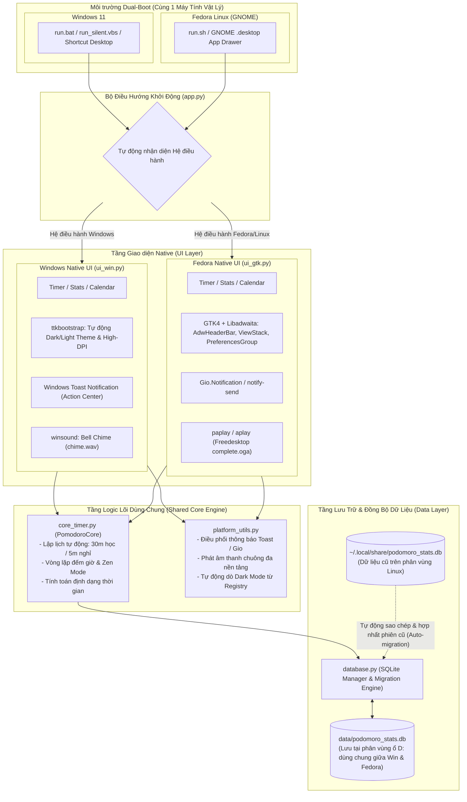

# Pomodoro Tracker (Dual-Boot Windows & Fedora Native)

Ứng dụng Pomodoro Tracker & Focus Timer được thiết kế chuyên biệt cho hệ thống **Dual-Boot (Windows & Fedora Linux)**:
- **Trải nghiệm Native trên từng hệ điều hành**:
  - **Fedora (Linux)**: Giao diện **GTK4 + Libadwaita** chuẩn GNOME, tích hợp thông báo hệ thống và hiệu ứng âm thanh freedesktop.
  - **Windows**: Giao diện **Windows 11 Native** hiện đại (hỗ trợ tự động Dark/Light mode theo Windows, High-DPI), thông báo Windows Toast (Action Center), âm thanh chime thông báo.
- **Đồng bộ dữ liệu 100% (Shared Database)**:
  - Toàn bộ lịch sử học tập, streak (chuỗi ngày), mục tiêu ngày và thống kê tháng/năm được lưu tập trung tại thư mục `data/podomoro_stats.db` (nằm trên phân vùng ổ đĩa dùng chung giữa 2 OS).
  - Tự động di chuyển (auto-migrate) dữ liệu cũ từ Fedora (`~/.local/share/podomoro_stats.db`) sang database dùng chung ngay trong lần chạy đầu tiên.

---

## Sơ đồ Tổng thể Hệ thống (System Architecture)



---

## Cấu trúc dự án

- `app.py`: Điểm khởi động thông minh (tự động nhận diện hệ điều hành để khởi chạy UI phù hợp, hoặc qua tham số `--ui gtk` / `--ui win`).
- `core_timer.py`: Xử lý logic tính giờ, chia block (30 phút học / 5 phút nghỉ), chế độ Zen Mode, tích lũy thời gian.
- `database.py`: Quản lý SQLite database, truy vấn streak, thống kê ngày/năm, calendar grid và tự động migration.
- `platform_utils.py`: Tiện ích đa nền tảng (phát âm thanh chuông, gửi thông báo Toast/Gio/notify-send, nhận diện Dark Mode).
- `ui_gtk.py`: Giao diện Native GTK4 + Libadwaita cho Fedora.
- `ui_win.py`: Giao diện Native hiện đại với ttkbootstrap cho Windows.
- `assets/`: Biểu tượng (`icon.ico`, `icon.png`), file âm thanh chuông (`chime.wav`), script thông báo (`toast.ps1`).
- `data/`: Nơi lưu trữ file SQLite dùng chung (`podomoro_stats.db`).

---

## Hướng dẫn sử dụng

### Trên Windows
1. **Tạo Shortcut trên Desktop**:
   - Nhấp đúp vào file `create_desktop_shortcut.bat`.
   - Một lối tắt **Pomodoro Tracker** với biểu tượng quả cà chua sẽ xuất hiện trên màn hình Desktop của bạn.
2. **Khởi chạy ứng dụng**:
   - Nhấp đúp vào shortcut trên Desktop, hoặc:
   - Chạy `run.bat` hoặc `run_silent.vbs` (chạy ngầm không hiện cửa sổ đen cmd), hoặc:
   ```cmd
   python app.py
   ```

### Trên Fedora (Linux)
1. **Tạo Icon trong danh sách ứng dụng GNOME**:
   - Mở Terminal trong thư mục dự án và chạy:
   ```bash
   chmod +x run.sh install_desktop_entry.sh
   ./install_desktop_entry.sh
   ```
   - Ứng dụng sẽ xuất hiện trực tiếp trong App Drawer của GNOME.
2. **Khởi chạy bằng script**:
   ```bash
   ./run.sh
   ```

---

## Kiểm thử tự động (Unit Tests)

Chạy test suite trên bất kỳ hệ điều hành nào:
```bash
python test_suite.py
```
Test suite bao gồm kiểm tra:
- Khởi tạo và ghi nhận database SQLite.
- Logic tính toán streak khi học qua nửa đêm hoặc nhiều ngày liên tiếp.
- Auto-migration từ database cũ sang database dùng chung.
- Bộ đếm thời gian core (`core_timer.py`).
- Giao diện Windows Native (`ui_win.py`) và giao diện GTK4 (`ui_gtk.py`).
